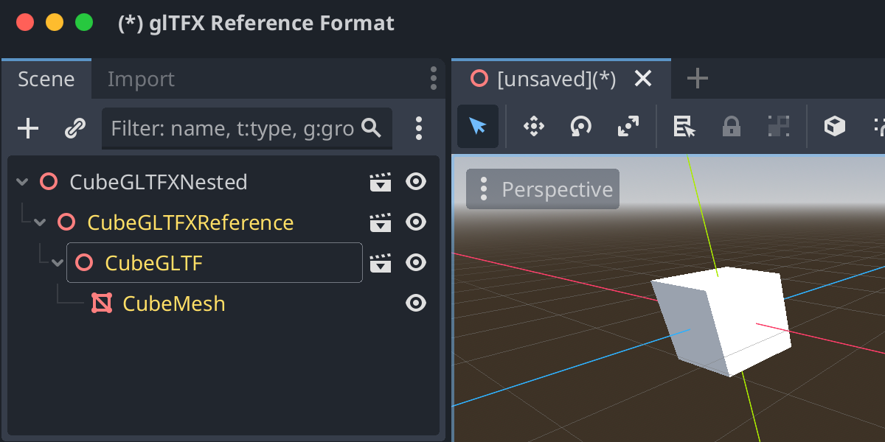

# Godot glTFX Reference Format

Godot implementation of the [glTFX Reference Format](https://github.com/KhronosGroup/glTF-External-Reference), also known as glTF External Reference, glTF Experience Format, or glXF. The glTFX format allows for referencing external glTF files, and also other glTFX files, allowing for a nested scene hierarchy of arbitrary depth, with its leaf scenes being glTF files.

**Note:** The glTFX Reference Format is still a work in progress and is not yet ratified by the Khronos Group. Until glTFX is finalized, this addon should be considered experimental and subject to change at any time to comply with the latest iteration of the draft specification.

For full functionality, this addon requires Godot 4.4 or later with [this PR](https://github.com/godotengine/godot/pull/94603). It can be used with Godot 4.3, but the export settings will not be available.

The addon is licensed under The Unlicense. Anyone is free to use this without restriction. Credit is appreciated but not required.

Here is an example of exporting a glTFX scene which contains another glTFX scene which contains a cube glTF file. The file hierarchy is preserved both when exporting from Godot and importing into Godot.

